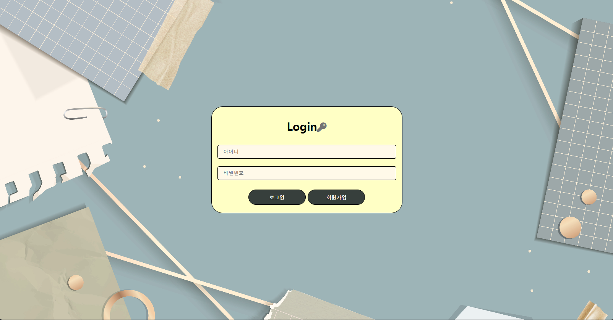
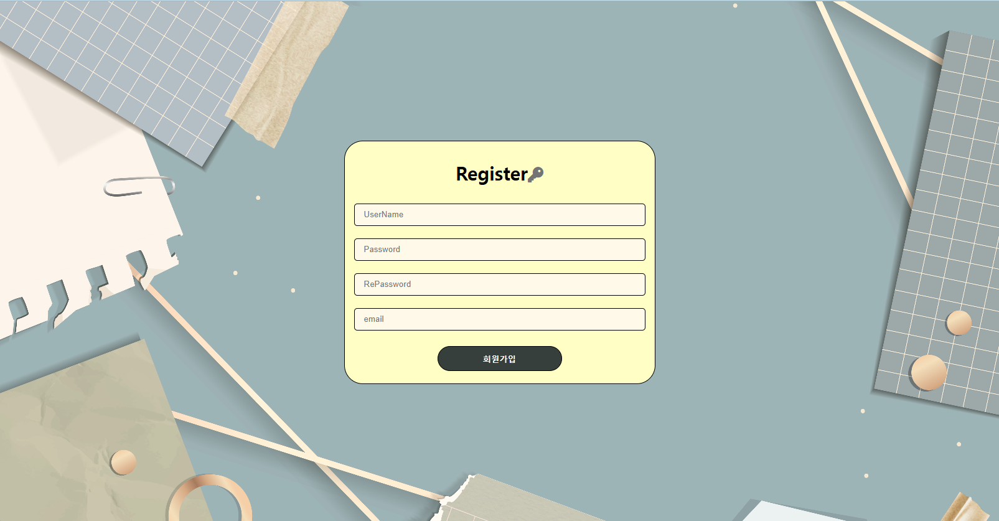

# NoticeBoard 프로젝트

나의 첫 프로젝트!   
시작이 반이라고 하니까 난 앞으로 더 성장할 거라 믿으며 즐겁게 프로젝트 하자!!

### 사용하는 언어 및 프레임 워크
- Java(Spring Boot)
- MariaDB(데이터 베이스)

이 프로젝트는 제가 처음으로 시도해보는 프로젝트라 딱히 기획은 안했구여   
그냥 그때 그때 생각나는대로 기능 다 때려 넣을 생각입니다.   
로그인도 제대로 구현 못하는 제가 그래도 꾸준히 노력해서 코딩 이빠이 잘해지고 싶음..

<blockquote>

- ## 1일차
  - 로그인화면, 회원가입화면 구현(html, css 사용)

    ㅋㅋ.. 놀랍게도 로그인 화면임...

    ....   
    반성 하겠습니다..ㅠㅠ   
    이게 저의 1일차 결과물입니다... 앞으로 많이 공부해서 남들보다 뛰어난 개발자가 되고 싶어요...
  - 아직 FrontEnd 부분만 함.
  
<blockquote>

### 느낀점
    아직 겁나게 미숙함... css부분이 너무 어려웠음.. 그래도 나름 해본다고 했는데 나도 만족 못함.
    드럽게 못만듬... 미적감각을 떠나서 어떤식으로 디자인을 해야하는지 감이 잘 안잡힘.
    다른 분들은 css로 애니매이션도 구현하고 하던데 나는 왤케 어려운 거지..
    내일은 js도 함께 사용해봐야 겠다...

</blockquote>

</blockquote>